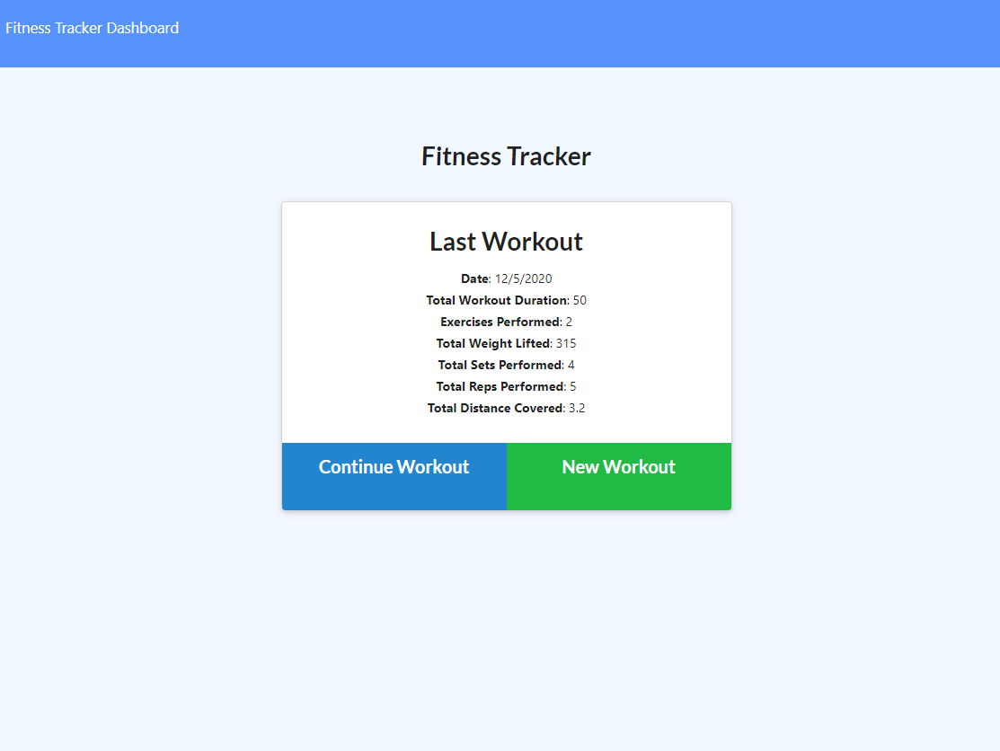
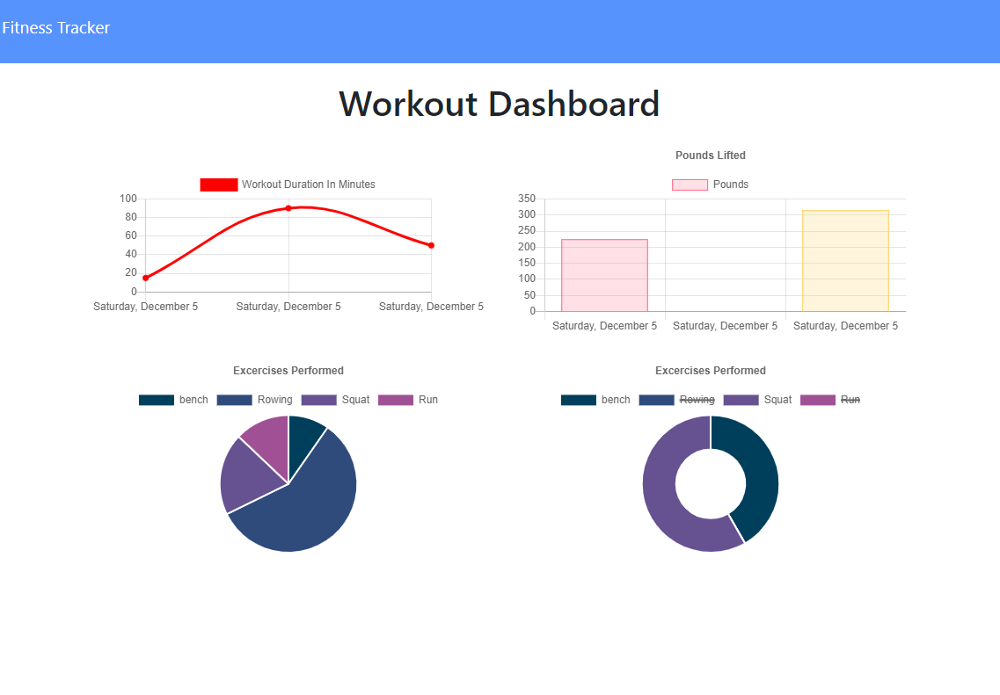

# Hashtag Fitness

## Description
This application is a workout tracker.  The user is able to input various workouts as they workout.  This data is saved in a MongoDB and compiled in a summary on the Workout Dashboard page.   

### Home Page

### Workout Dashbard

## Table of Contents
* [Installation](#installation)
* [Usage](#usage)
* [Credits](#credits)
* [License](#license)
* [Contributing](#Contributing)
* [Tests](#Tests)
* [Questions](#Questions)

## Installation
Clone this repository and run command "npm install" to get dependencies

## Usage
### To run locally
Enter the command "npm start" to start application and navigate to localhost:8080 in your browser
### Use on Heroku
[Heroku Application](https://hashtag-fitness.herokuapp.com)

## License
This repository is licensed under the MIT license

## Contributing
No additional contributions are expected for this application

## Tests
There are currently no test for this application

## Questions
#### For any questions about this repository send an email to kory.nelson99@gmail.com
#### View my full GitHub at [https://github.com/korynelson](https://github.com/korynelson)